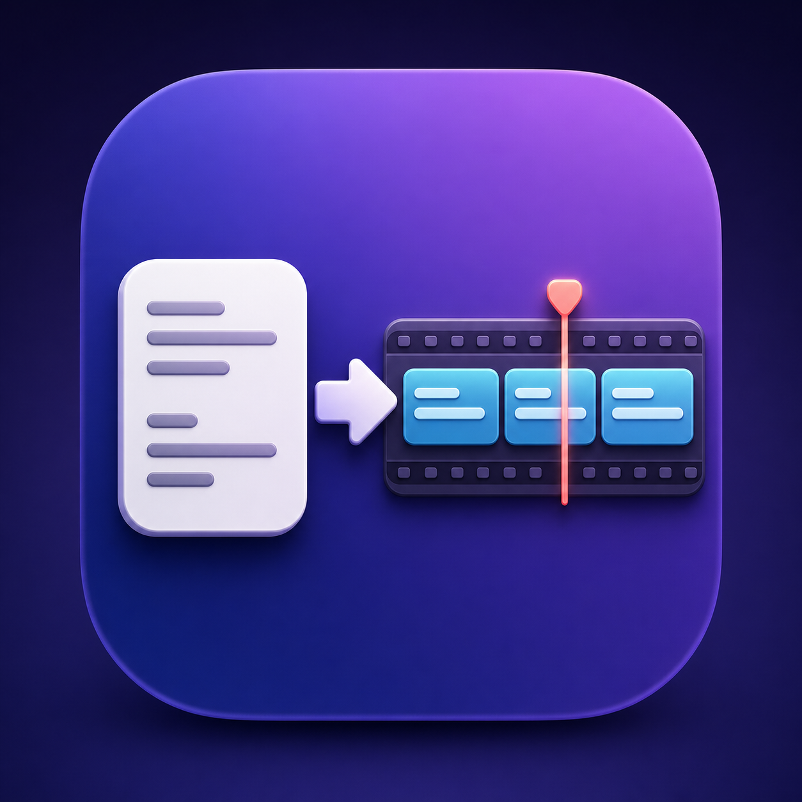

# SRT → FCPXML 템플릿 변환기



사용자가 Final Cut Pro에서 내보낸 FCPXML의 첫 번째 `title` 클립을 디자인 템플릿으로 사용해 SRT 자막을 생성합니다.

## macOS 앱 실행

Finder에서 `SRT to FCPXML.app`을 더블클릭합니다. Python이나 웹 브라우저가 필요하지 않은 네이티브 SwiftUI 앱입니다.

앱을 다시 빌드하려면 다음 명령을 실행합니다.

```bash
bash build_mac_app.sh
```

## Python 보조 버전 실행

```bash
python3 app.py
```

화면에서 SRT, FCPXML 템플릿, 저장 위치를 차례로 선택한 뒤 **변환하기**를 누릅니다.

선택한 FCPXML 템플릿은 앱 설정에 자동 저장됩니다. 다음에 앱을 실행할 때도 같은 템플릿을 사용하며, 사용자가 다른 템플릿을 선택했을 때만 변경됩니다.

Finder에서 `.srt` 파일과 `.fcpxml` 템플릿을 각각의 입력 영역으로 드래그 앤 드롭할 수도 있습니다.
파일을 Finder 또는 Dock의 앱 아이콘 위로 드롭해도 앱이 열리며, 확장자에 따라 SRT와 템플릿을 자동으로 구분합니다.

템플릿 선택 화면과 드래그 앤 드롭 입력은 Apple Motion 타이틀 `.moti` 파일도 허용합니다.

명령행에서도 실행할 수 있습니다.

```bash
python3 srt_to_fcpxml.py input.srt template.fcpxml output.fcpxml
```

## 템플릿 준비

Final Cut Pro 타임라인에 원하는 Motion 타이틀을 하나 넣고 글꼴, 크기, 위치, 색상 등을 설정한 뒤 FCPXML로 내보냅니다. 변환기는 템플릿에서 처음 발견한 `title`을 복제하고, 보이는 문구와 시작·종료 시간만 SRT에 맞게 바꿉니다.

현재 버전은 1단계인 **사용자 지정 템플릿 기반 출력**에 집중합니다. 그래픽 삽입 후 두 레인으로 밀린 자막의 재매칭 기능은 실제 샘플 구조를 확인한 다음 단계에서 추가합니다.
